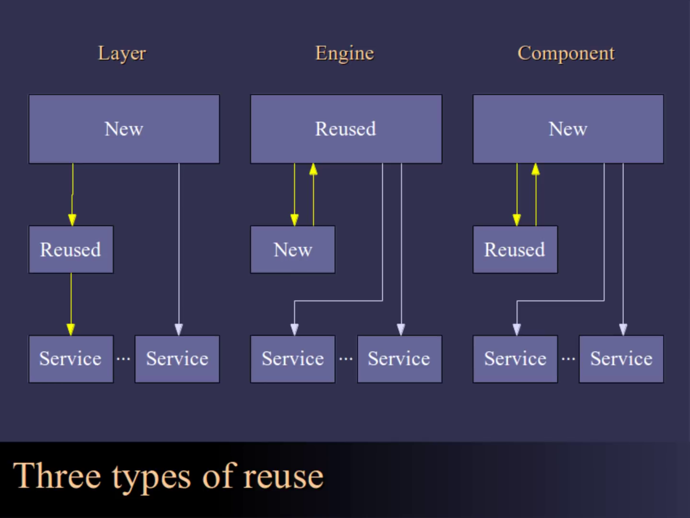
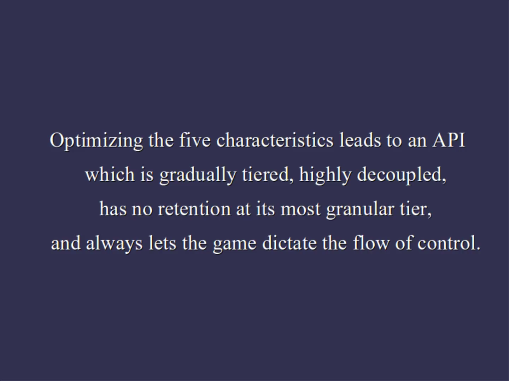

# Editor's Note
Casey Muratori's 2004 lecture "Designing and Evaluating Reusable Components" is my favorite resource on API design. The content has (to my knowledge) only been available in the form of a 50 minute video lecture. Unfortunately, that format isn't accessible to some audiences.

The following is my attempt at a manual transcript of the lecture, with minor edits to aid readability and some additional annotations to assist screen readers.

You can learn more about the talk and its historical context on Casey's blog [here](https://caseymuratori.com/blog_0024). You can also find the 50 minute video version of the lecture there, if that is how you learn.

I don't claim any ownership of the ideas or content; any mistakes are my own. I am deeply grateful for Casey's work, including [Handmade Hero](https://handmadehero.org), "an ongoing project to create a complete, professional-quality game accompanied by videos that explain every single line of its source code." If you find this material useful and have the means, please consider supporting him.

\- [Julian Ceipek](https://jceipek.com)

# Designing and Evaluating Reusable Components


Code reuse is something that, in general, everyone wants to be able to do. Either in-house or externally, you typically want to be able to solve a problem once, or license a solution from somebody, and just integrate it into your game and have it work. It's a goal that's common across many industries, not just the game industry.

So it's no surprise that there's lots of books on it, there's lots of people who speak on the topic, and that sort of thing.
But, in general, what seems to typically be the case is that a lot of the things that you hear about this or think you know about this, when you actually try to put them into practice, it turns out that they don't really work that well.
And you kind of sit there scratching your head going "we *thought* we were doing some of this code reuse stuff well, or we thought this component that we looked at to license had a good API, but when we actually tried to use it in our game, we start to feel like getting a little more NIH (Not Invented Here) about the problem, because God, it just didn't work out that well, it caused all sorts of problems and so on."

Where this lecture kind of comes from is:
I worked at RAD game tools and I was responsible for doing Granny, which is RAD's character animation package. And at the outset of that, I made the first version of it according to what I thought were standard reusable code principles, and it turned out to just not really work very well.

A lot of people had a lot of trouble integrating it, and things just didn't go the way that I thought they should.
So we spent a lot of time--when we went from version 1.0 to 2.0--kind of looking at that and going "what happened there?", and we learned a lot of things and the second incarnation of the product actually is used in I think 400 different SKUs (unique products) which is a vast vast increase from the original one.

So with this lecture I kind of tried to go back and go "okay what were all the things we learned about that, and how did we make that jump? Are they generally applicable? Are there things we can generalize on this: real rules we can use to get reuse in the game industry that are from practice (and not just some kind of theoretical thing that doesn't seem to really play out in practice)?



So before I get into it I wanted to quickly go over the types of reuse that we typically see.

1. The first kind here on the left is what I call _"Layer"_ which is the OpenGL or Direct3D kind of a thing where you've got
- new code that you're writing on top, which is your game or something,
- you've got reused code, which is the Layer which is the Direct3D part or whatever the API is that's provided

  to abstract

- some service that's down at the bottom, which is like the 3d hardware or something like this.

This kind of reuse is pretty common now, and it seems to be working relatively well (although there's still some problems within that sort of thing).

2. The second kind is _"Engine"_ code where the situation is kind of inverted.
- The reused code is up at the top making all the decisions--it's the majority of the system--and you're just writing
- this smaller subset of that, conforming to its rules, giving it information back to define your game, and
- it's pretty much responsible for ending up dealing with all the output and that sort of thing.

3. And then finally we have the third kind, which is kind of the new thing which hadn't been around really, in any successful way, up until very recently. These are _"Components"_, and those are things where it's still kind of like the layer situation where the new code is up at the top, and the game code is all in control, but there's these little pieces that you can license which not only accept input from you but actually give stuff back that actually determines how the game runs. They're tightly integrated, and these are things like character animation, physics, AI, that sort of thing. And they don't really talk to services directly; there's no well-defined output layer for them, they just give you stuff back and then you're responsible for kind of doing it.

Now the reason those are important and the reason that Layers aren't the only thing that we need--I mean engines I'm not really going to cover because that's just a totally separate topic--the reason that components are important is because if you look at layers, they're very limited:


They require there to be some well-defined service at the bottom that they're abstracting, like 3D hardware.

And if they don't have something like that, if you want something like AI where there's no agreed-upon standard for what the output is, then they just can't really exist. And similarly, if you have two layers that you're trying to use in the game simultaneously, well that just isn't going to work at all. If I have two things that expect to be talking to the 3D hardware, that can be a huge disaster, because each one wants control over it, and how do you broker between them? So it's no longer this clean "I give something to it and it puts something out".


Components solve both of these problems. They don't need a service at the bottom, they can just be there. You give them data, they process it, they give data back, it's all good. And similarly, if there's one service--one output that you're dealing with that both components are concerned with--that's fine because the input is coming back into the game where you can broker between them, resolve conflicts, do anything you need.


Components are really the most powerful form of subsystem reuse that there is, and they're the ones that we happen to need to solve a lot of the problems of reuse for components we don't have currently. The problem with them is they're much harder to design, and the reason for that is this little back channel here:


It's a little simple arrow, but in reality the fact that it is coupled back to the game and you have to rely on what it's giving you to make gameplay decisions, to do all these things, really does mean that it's a vastly harder design problem than just output only.
And that's not to say that Direct3D and OpenGL weren't hard to design, it's just that these are even harder, and that's unfortunate.

So what I'm going to do here is:
For a couple slides I'm going to introduce a model for how to look at the way games integrate things--which may or may not be unique from how other industries integrate things--I don't have much experience with that. But for games there's a very specific way that integration typically happens with components.
So I'm going to go through a little bit of that, and then I'm going to go into some really very in-depth code snippet kind of stuff where I take you through all of the different ways that you can use this model to look at what's happening in making decisions about either:

- "Is some licensable API that I'm going to use going to work well?"

  or

- "I'm trying to design an API that I can reuse in-house or for other developers; what can I do to make those APIs better?"


So here's my little sort of pseudo graph.

The vertical axis here is how much work was done to integrate the particular API into our game, and down here is time.

And what some people tend to gloss over, if you read books about this sort of thing, is that integration isn't really something that you just sit down and *do*.

We don't one day decide to integrate physics into our game, spend a week on it, and then we're done, and that's the last we hear of it. *That's not what happens.*

What really happens is: yes that part of the process is over here somewhere--we do the initial integration and then it's in the game. But then in reality, usually as we go, we use a little bit more of it, and then we get to some point where we have some major push that we're trying to do.
And at that point, we typically have to start getting more involved with the API because there's things we need to do. For example we have memory budgets we need to hit, we need to add some features that we didn't think we were going to need (or that we put off integrating, and now we need them for this demo, we need them for whatever we're trying to ship).
And we get kind of this little spike there, and similarly that typically happens again, at least once, at the end of the project. When we're trying to ship, there's all of these hard constraints that we have to meet. So it really is an _evolving usage_: it goes from initial, where we may even just be prototyping a game (so we're not even doing the official integration), all the way till we're trying to ship and nail down every little last piece.


Okay so here's the abstract part, so try to put on your abstract cap.
What I want to do is get you in the mindset of thinking about the options that you or other developers have for integrating a particular thing into their game: a particular component.
I took _time_ out of this now, so we're just looking at a single point in time. The amount of work to integrate something is on the vertical axis, and the amount of benefit to the game is on the horizontal axis, and these big blue circles are just representing options that the developer has for integration.
When I go to integrate something like character animation into my game, there's a number of ways I could do it. I look at the game engine and I look at the component, and I go "well, we could do something like this, we could wrap it like this, we could put it in over here, we can fork it and put part of it over here and over here." You've got a number of ways in which you can integrate it.
And typically as you go, the more integration work it is for you, typically the more benefit you could get, because the more tighter coupled you become to this component, the more things you can do with it.
If you start managing its memory for it, then you're gonna get performance benefits, and there's all these kind of things as we go up in integration work.
So what happens is when you initially integrate it, you've got some minimum bar that you're trying to meet in terms of benefit:


We need these features for the game right now, so we're just going to try and meet that. And you have particularly smart programmers, so they're gonna kind of go "well this is kind of the thing that's the least amount of work that gives me the most amount of benefit that meets the bar, right? But I could do a little more work and maybe get something that I thought was a little more beneficial, so maybe I will."
You're gonna pick something kind of down here to get it in, get it working, get the game running, and get on with things.


Then as you go, at some point there's going to be some new requirements, you're going to need more benefits from this API. And when I say benefits, I don't necessarily mean features, I just mean there are things that you need from it:

- the ability to get its memory footprint down,
- the ability to reclaim some processor time

Those things are all considered part of this because they're integral to shipping the game.

So as this bar moves across you're going to start going "okay well, we need to integrate a little more, we need to integrate a little more, we need to change what we're doing, call some different APIs, do that sort of thing."

And you move through this space of possibilities that you had.

And then finally, what happens if you get into trouble, is you get to some part where the requirements change:


And there is no easy jump to get you there. You have this thing you have to do, and maybe it's some hard budget that you have to meet, and you realize that the way that you were using the API, there just is no simple fix. There's no way that you can get, say, _streaming_, which you want to implement in your game, into this component in any reasonable amount of work. It's going to be this massive thing where you have to do all sorts of stuff behind its back and do all these kinds of things. So you end up looking at a situation like this where you're thinking "wow, to get this extra thing that we needed to do to ship this game, we have to do a _massive_ amount of work to deal with this component."


To summarize that, if the API has these little steps, and I want to meet this minimum bar of features that I've got to get for this next drop, to go from unsolved to solved, I just want to take a little step. I want to do whatever I feel is the minimum work that I should generally have to do to get this thing in there. But if there is no option for that, then they typically will have to jump all the way to something which, while you had to do a ton of work to get there, really solved a lot more problems than you were looking to solve. You ended up doing a lot more management or a lot more work with this component than you would have liked, and maybe there are fringe benefits to that, but a lot of times those benefits aren't really realized to you, you just wanted to manage one little piece of it for the component, for example, but now you ended up having to manage _all_ of its memory, let's say.


I call that an _Integration Discontinuity_, which is where I'm going along using this component, and all of a sudden I hit this wall, and I'm like, "man, this is a disaster." And unfortunately, they typically happen around ship time, just when it's most unfortunate to have such a thing happen.


I guess this a little like beating a dead horse, but just to go through it: if you think about this yellow line as how much work you actually did to integrate the product--meaning, I'm actually doing this work, and I keep doing work, I do more work, and I do more work--when you have these discontinuities in there, what happens is, you're really doing _more work_ than the _benefit that you are getting_. So when I have to do more work than the minimum that I wanted to do to get this feature in, then the actual benefit to your app isn't going up commensurate with the work. You're _spending a lot of extra work_ to work _around this API_ that you're forced to deal with.
And this doesn't even _have_ to be increasing, because what could happen is: if you're spending time integrating a component, you may find out that the way that you were integrating it isn't actually working, and you have to rip some of it out, redo the way you were doing it, throw out code you wrote to reintegrate it a different way. So you can actually end up going "okay, we got to tear some out, we tried this other method, and that didn't work, so then we tried going around to this other way, and we finally found an end-run that worked, and now we keep going and so on."

I guess all I'm trying to say with this graph is it's non-trivial when you have these API problems in there, it really can force you to blow out a _lot_ of work, and that's why I posit that's the real problem.


The goal that we're trying to solve when we design reusable APIs is to think about this, and to try to make it so that, at all times-- as people integrate the product--they are always able to do only what they think they should have to do to get the next thing that they need out of the API, and not waste all of this time.
Because really when they use code--I mean from a licensor perspective, that's what the customer ends up remembering: they don't remember if you saved them some work at some point, they remember when you caused them this _huge disaster_ right around ship time. And similarly, if you're the person doing that, you don't want that disaster, so this is really the thing that I think is most important.


Now unfortunately, with the current trends in API design, where you're kind of wrapping stuff up and doing a lot of encapsulation, doing a lot of insulation, what they actually do is they take the number of options that are available to the developer (which are these blue things as I said before) and they start to reduce them. They go "you know what, you can't 


really have access to these things, you can't


call these things that are calling these other things", and at some point sometimes you even get to the point where you look at an API and you're like "you know what, there's only one thing I can do with this:"


"They've totally walled me off, I have no options anymore, this is a disaster."

These kinds of components typically fail, but a lot of times we're stuck with just this kind of thing:


where you look and there's a low level or high level you would use. And I argue that really, we want things to look like this: 


And ideally fill in the gap that I was talking about before.


That was very abstract, I drew a graph that had some blue points on it--that's all great, but how do I actually know, when I'm looking at an API:

- Is it going to have these problems?
- Are there discontinuities in there?
- How many options does it really give me?

Originally I only had four, in fact if you look in my lecture notes there were only four, but I was showing some of the slides to Chris Hecker and he said, "you don't talk about flow control enough, you've got to talk about flow control--it's implicit in all the things you're talking about but you're not talking about it".
So I looked at it and he was totally right, so I added a fifth one which does really matter, so props to Chris for that.

The five things are, in order:
- _Granularity_, which is to say that I have some API, and I can split it into smaller APIs. If I have an API A, I can replace it with two APIs that do the things that it did, but give me a little more control.
- There's _Redundancy_, which is to say that there's an API that does something which is A, but I could alternatively call some other API which does the same thing B, only maybe it takes slightly different parameters, or it does it in a slightly different way, so I have some options there.
- There's _Coupling_, which is when you have one thing and if you do that thing in the API, you're required to do some other things. So there's this hidden link in between them that you are not really able to overcome.
- There's _Retention_, which is when the API has two things, and one's on your side and then the other is on their side, and you have to mirror them, like making a scene graph or something like this.
- and finally there's _Flow Control_, which is: who's calling who? Am I calling them, is the component calling me? Am I calling it, and it's calling me back? What's going on here?

The important thing to remember is these are just characteristics and each one of them has trade-offs which I'll talk about later.
So it's not the case that some of them are _always_ bad. Sometimes it's good to have less granularity, sometimes more, don't think of them as hard-coded "we want all these five things".
No, each one of them is just a characteristic and we'll talk about how to interpret them in a second.


Let's go through the kinds of granularity; some of them are non-obvious. 

```C++
/* Granularity Snippet (A) */
    UpdateOrientation(Object);
```

(A) The most obvious thing is if I have something like `UpdateOrientation`, and what this function is supposed to do is: the API has some measure of my orientation that it's keeping, and it's got some measure of the change in orientation, and I want to go ahead and apply that change so now when I use the orientation, it's the new orientation.

```C++
/* Granularity Snippet (B) */
    Orientation = GetOrientation(Object);
    Change = GetOrientationChange(Object);
    SetOrientation(Object, Orientation + Change);
```

A simple granularity change (B) is okay, I want to break that down into steps:
- I want to get the orientation myself,
- I want to get the change in orientation myself from the API,
- and then I want to set the thing with that change (and these are angles or something so that's no overloaded plus operator, it's just a regular 2d angle).

That's the most \[simple?\] sign of granularity.
The reason that I want that is because, hey, I may want to modify whatever is going to happen in there (C):

```C++
/* Granularity Snippet (C) */
    Orientation = GetOrientation(Object);
    Change = GetOrientationChange(Object);
    Change += 3.14f; // TODO: Close enough to Pi?
    SetOrientation(Object, Orientation + Change);
```

I may not want it to just use it directly (the change that it has); I may want to play with it.

And similarly, the less obvious version of that (D) is:

```C++
/* Granularity Snippet (D) */
    Orientation = GetOrientation(Object);
    Change = GetOrientationChange(Object);
    RunSomeOtherUnrelatedThing();
    SetOrientation(Object, Orientation + Change);
```

I may not even want to change it, I may want this to happen exactly the same way that it would have if I just called it, but I have this other thing that I want to have happen, so instead of modifying things by inserting myself in the middle, really all I'm doing is I'm separating when the API is going to do those two things and that may not be that important in other industries. But in the game initially that's crucial, because sometimes you thread things, sometimes you have things that you need to hold over till the end of the frame, so you really don't want to be in positions where you don't have that kind of control, so that kind of granularity is also important.


Let's talk about redundancy (because hopefully granularity is pretty clear). Redundancy in its most basic form is something like this: (A) I wanted to pass a 3x3 matrix before:

```C++
/* Redundancy Snippet (A) */
    SetOrientation3x3(Object, Matrix);
```

and now (B) I want to pass a Quaternion:

```C++
/* Redundancy Snippet (B) */
    SetOrientationQ(Object, Quaternion);
```

So the API gives me two calls and I can enter in either way and it just accepts the type of parameter that I was looking for, it doesn't do anything different.

(C) and (D):

```C++
/* Redundancy Snippet (C) */
    IdentifyOrientation(Object);
    FaceForwards(Object);
```

```C++
/* Redundancy Snippet (D) */
    OrientInDirection(Object, Vector);
    OrientTorwards(Object, Point);
```

are a different way of looking at that, which is that hey, sometimes I figure that there should be these basic things that it can just do for me. I don't wanna have to make my own identity matrix and pass it, that sort of stuff. There's just constants that the API builds in that're easy for me to use and that way I just know it's taken care of.

And similarly, oftentimes there are things that I would do with the orientation and I just want it to do those basic operations for me to set the orientation, and that's (D) so those are just some different redundant ways of doing that.

Now the sort of subtle way of having redundancy is this kind here, where if you remember in the previous slide we had this operation (B):

```C++
/* Granularity Snippet (B) */
    Orientation = GetOrientation(Object);
    Change = GetOrientationChange(Object);
    SetOrientation(Object, Orientation + Change);
```

where we're getting the orientation, getting the change in the orientation, and then setting it.

Well if I was to go up a level of granularity from that, I could have the option of bundling those three calls in two different ways:

I could bundle the first two calls and leave the third one at the the finer level of granularity (E):

```C++
/* Redundancy Snippet (E) */
    NewOrient = GetOrientAndChange(Object);
    SetOrientation(Object, NewOrient);
```

Or I could bundle the second two calls (F) and leave this one at the finer level:

```C++
/* Redundancy Snippet (F) */
    Orient = GetOrientation(Object);
    SetOrientDelta(Object, Orient, Change);
```

So they're both kind of equivalent: these two snippets are at the same level of granularity, but they have different choices in redundancy in terms of: they have different choices in what to bundle, which makes a redundant API. That can typically be pretty useful--as you make coarser grained versions of an API--to have the user have the ability to choose which ones they're going to bundle and which ones they're not.


So now we get to coupling which is not really a trade-off thing; coupling is pretty much always bad, but it's usually also unavoidable in a lot of places. The simplest kind of coupling in an API (A) is when you have something that does things to lots of objects and you have no control over that:

```C++
/* Coupling Snippet (A) */
    UpdateEverything(Universe);
```

A very typical thing is `Simulate` in a physics simulator where I wanted some control over what was getting simulated because I have some special things that I want here, but maybe this API doesn't let me do that, so I have to have everything happen at once. Obviously that's bad coupling, that's inter-object coupling.

The other kind of coupling (B) is: hey, I've got some APIs which depend on this one state that I set:

```C++
/* Coupling Snippet (B) */
    SetTime(GlobalTime);
    UpdateObject(Object);
```

So maybe I call `SetTime` and it retains this time information, but then lots of different APIs use that, so I'm creating a hidden sort of coupling between those APIs in the sense that they all have to have this right ordering of: if I set the time and then call this, I can't then call the other thing which counted on the time being the thing from the previous frame so I have this hidden coupling that I have to think about in my head.

```C++
/* Coupling Snippet (C) */
    BeginObjectSpecification();
    Object = EndObjectSpecification();
```

Snippet (C) is the kind of coupling you have in `glBegin` and `glEnd` for example, which is that there isn't any identification for a particular _lock_ that I'm doing, so I can only have one of them at any given time. I don't really get anything back from this and I don't pass anything into this, so there's really just this one implicit lock that either I am or I'm not using and that couples it in the sense that two pieces of code can't do that, and you have to make sure that all the code is always serially doing something like this.

```C++
/* Coupling Snippet (D) */
    String1 = GetMungedName(Name1);
    String2 = GetMungedName(Name2);
```

(D) is very simple, which is hey, if there are internal buffers, are those internal buffers going to be things that we have to pay attention to? So in this case if I was returning a `char*` for example, this is probably returning the same buffer as this, so I've got this hidden coupling where `String1` actually becomes the same thing as `String2` here. Hopefully that doesn't happen too much in modern APIs but I figured I'd mention it.

```C++
/* Coupling Snippet (E) */
    Object = AllocateAndInitialize();
```

Snippet (E) is a more insidious form of coupling: it's when the allocation of something is coupled to its initialization, and a lot of APIs have this problem unfortunately. A lot of times, developers don't really want to have to be able to say "get me the memory for this thing and initialize it". They might want to say "I'm going to provide the memory and then could you just initialize it in place?" or "you're managing the memory but I need to initialize this guy because I'm reading it from this special stream that I have packed or whatever". So that's a kind of coupling where I bundle two things together that cannot ever be separated.

```C++
/* Coupling Snippet (F) */
    Matrix = MakeMatrixFrom(FloatPointer);
    SetOrientationM(Object, Matrix);
```

(F) is where I have coupling between some special type in the system. If I only accept a matrix for my orientation, if that's the only type that I accept here, then even if I have some representation of the matrix myself, I have to constantly make it with the API, I have to say: "hey, make one of your special fancy matrix objects so that I can actually call your functions".

```C++
/* Coupling Snippet (G) */
    Object = ReadObject(Filename);
```

And the final kind of coupling (G) is when the API doesn't let you get away from depending on their file format, so in this case it's if the only way to get an object is to read that object with their file reading routine, I can't construct it myself with my own reading it in then I'm dependent on their file I/O routines and their data format, and there's nothing I can do about that really.


Retention is pretty simple, so not many code snippets here.

The idea there is: if I have stuff that is data that I own or that I am the one who's in charge of but the API forces me to announce that data to it, and it keeps a copy, that's retention.

```C++
/* Retention Snippet (A) */
    SetTime(GlobalTime);
    SetPi(3.14f); // TODO: Close enough to Pi?
```

In (A) it's the simplest kind: I'm going to set the time or I'm going to set what I think the value of `Pi` should be for the application, then it just retains that information and is going to use it everywhere.

```C++
/* Retention Snippet (B) */
    SetParent(ChildObject, ParentObject);
    UpdateOrientation(ChildObject);
```

In (B), we have: "I'm going to tell you that this object is parented to this other object, so every time you do something like update the orientation, you're going to take that into consideration".

```C++
/* Retention Snippet (D) */
    SetFileCallbacks(Open, Read, Close);
    File = OpenFile(Filename);
```

And then finally in (D) we have the kind where you're retaining services from the application so the API is going: "when I open a file, I could call you back with some of these things." So it's going to retain the services that you provide it and use them whenever it would have used them in the middle of processing some of its various function calls.


Finally, we have flow control, and flow control is pretty easy to imagine. Pretend these are just stack traces and a measure of flow control is: "who is calling who?"

```
/* Flow Control Stack Trace (A) */
=> LibTestNoodleWidgetHit
   LibProcessNoodleWidget
   GameProcessWidgets
   GameUpdate
```

Is it the case that the game is on the bottom of the stack (A), then it calls into the library and that's always the way it looks; that's all we get, so library on top game on bottom?

```
/* Flow Control Stack Trace (B) */
=> GameHandleNoodleWidgetHit
   LibTestNoodleWidgetHit
   LibProcessNoodleWidget
   GameProcessWidgets
   GameUpdate
```

Or do we have a situation (B) where the game, which was originally calling the library, now gets called back and there's sort of library in between, game on either side of the stack.

```
/* Flow Control Stack Trace (C) */
=> LibNoodleWidgetChangeHeight
   GameHandleNoodleWidgetHit
   LibTestNoodleWidgetHit
   LibProcessNoodleWidget
   GameProcessWidgets
   GameUpdate
```

Then we could get totally crazy (C) and say a lot of times then, the game has to call the library for something, so we can keep \[at it?\] ad infinitum. If we allow this kind of flow control stuff to happen we can get these ridiculous stacks where I call the library, the library calls me back, I call the library, maybe it calls me back one more time.
This is obviously a negative thing because the more this happens the more complex it is to visualize in your head what's going on in your relationship to this library. Furthermore, it can be really nasty where it has to call back one of your classes or you have to have `void*`s which tell it what the data is that you're going to need inside there because you no longer have your scope. There's a lot of complexity when you start to do some complicated kinds of flow control that aren't just (A).


And the code snippets for that are:

- (A)
  ```C++
  /* Flow Control Snippet (A) */
      File = OpenFile(Filename);
  ```
  This is the most basic kind like we said before; I just call a function and it returns something, everyone's happy.
- 
  ```C++
  /* Flow Control Snippet (B) */
      SetFileCallbacks(Open, Read, Close);
      File = OpenFile(Filename);
  ```
  (B) is the slightly more complicated version where it's going to call me back, so I do open file and I get a callback for it.
- 
  ```C++
  /* Flow Control Snippet (C) */
      class my_handle : public file_handle
      {
      public:
        virtual void Open(char *Filename);
      };
  ```
  (C) is just up here because it's the same as (B). If anyone thinks that (C) is not the same as (B), definitely rethink that because this is just a function pointer: a virtual function. There's a vtable somewhere so if you're inheriting from one of the API's classes, that's exactly the same thing as setting some file callbacks.
- 
  ```C++
  /* Flow Control Snippet (D) */
      throw 3.14f; // TODO: stop using exceptions
  ```
  And then finally you could use exceptions (D) or something to transfer flow control, but hopefully that's not a big part of any licensable API.


Here's the recap:

We have granularity and essentially what we do with that is we trade off flexibility for simplicity; the more coarser grain the granularity is, the simpler the API is to use because there's less calls, less things for the user to get wrong, etc... But we give up flexibility. As we go up there, we're at the point where they're really out of control: they don't have control, they're just telling you what to do and the API does it entirely the way that they want.

With redundancy it's really a trade-off of convenience versus orthogonality. If your thing is very redundant, then you're going to be very convenient cuz there's tons of these APIs to choose from for every different thing to do, but you're not very orthogonal--it's a little harder for the user to keep in their head because there isn't just one way of doing the things they're going to do, there's lots of different ways.

With coupling, there really isn't much of a trade-off, we'd like the API to be as decoupled as possible because all it's doing is putting restrictions on what the programmer can and can't do: there's really no benefit to that one.

Retention is a synchronization versus automation thing where if I retain a lot of data, then it's hard because the user has to synchronize all that stuff and that's bad. Immediate-mode things are better because there's no synchronization involved where they have to constantly keep you updated, but you may lose some automation there, because if you have all this retained data, then the API can maybe automate things for you that it couldn't otherwise.

And finally flow control: again not much of a trade-off there, if you can get away with always having the game in control (and it calls the app and it returns to you) that's always simpler because you don't want to have to worry about these deep callback situations or how you get data down through the library to you on the other side and so on.


The final thing that I want to mention about that is just that looking at all those trade-offs they're not necessarily constant throughout the course of the integration. When I first integrate a component into my game, I'm probably looking for very low granularity so I'm looking for even a very coarse-grained granularity approach and a lot of retention, because I just want to do something like load some characters off disk and animate them walking around and free them later. That's the level I'm looking for when I'm just in pre-production or doing my first integration into the game.

But as I get to the end of the project I typically need the reverse. I need a lot of control so I need fine-grained granularity in several places that I really need to manhandle, and I don't want a lot of retention because I've built all these data structures that say the way my game works and the less of that I have to mirror on the API side, the better. 


Now I'm going to look through actual code snippets that are not exactly the same as code snippets in a game but they're very very similar so we can look at what happens when some of these things are not at the proper level that they should be, just to give you a feel for:

- If you're designing an API, how you should be looking at it,
or
- If you're evaluating an API, looking at what the consequences of that API are.


Obviously I've changed this, so none of these are specifically somebody's API, they're just very representative of the standard ones that are out there.


First thing let's look at game provided services.

```C++
/* Game-provided services Snippet (A) */
    Thing = ReadFile(Filename);
```

Here's a case (A) where I was calling this `ReadFile` thing in the API, and I was getting back whatever the thing is that it gives me back: some kind of object that I'm going to use.

I want to stop it from from touching the disk; I'm going to manage that because I'm reading from my own database format or something like that.

What most APIs do--assuming they provide this at all, which hopefully they do--is we get something like snippet (B):

```C++
/* Game-provided services Snippet (B) */
    SetFileCallbacks(Open, Read, Close);
    Thing = ReadFile(Filename);
```

I set some file callbacks, which is basically just me saying I'm providing `fopen`, `fread`, and so on, so just call me when you would have called those.

Not only is it a problem for flow control because hey, now I'm getting called back by the API, but it's also a problem for coupling, in a non-obvious way. And the reason that there's coupling here is because you've _bundled_ the concept of reading the file _with_ interpreting it into this object that you can use. So I've actually smacked two separate things together, one of which is loading and interpreting an actual chunk of data off the disk, and the other is interpreting it.

So even if I allow the user to do those operations, I haven't given them any control over when they happen, because they're still gonna happen, right at this call, and there's no way to separate those two things out.

If the user actually wanted to separate them out, what they would have to do is make heinously complicated versions of these that do caching behind somebody's back, or God knows what's gonna happen.

The much more decoupled way that very very few APIs do, but some do, is to give you the ability to just pass in some file data (C). I already read it, I want you to go ahead and interpret this into a thing for me. And that's more what you want to see, because if you want this kind of control, typically you want something that's a lot more like this, where I'm just feeding it chunks and it's interpreting them into the type that I want:

```C++
/* Game-provided services Snippet (C) */
    Thing = MakeThingFromData(FileData);
```

Is that the most decoupled we can get? It's not.


```C++
/* Game-provided services Snippet (C) */
    Thing = MakeThingFromData(FileData);
```

You look at (C) and you go "well, this is still something that's owned by them. The thing that's coming back came back from the API, and I had no control of it." That's got to have some memory somewhere, something's going on here. At the very least let's pretend that the file data that it's interpreting is compressed in some way, so at the very least it's got to decompress it first before it can be used. What's happening inside this call is: the API is allocating a buffer or decompressing into it and then returning me a pointer to some part of that.

```C++
/* Game-provided services Snippet (D) */
    FileData = DecompressFile(RawFileData);
    Thing = MakeThingFromData(FileData);
    FreeFileData(FileData);
```

I could decouple it further; I can go like this (D) which is to say that I want it to decompress this raw file data into file data, and then it can make the thing I can use for me, and then I can get rid of this file data, because I don't need it anymore.

```C++
/* Game-provided services Snippet (E) */
    SetMemoryCallbacks(Allocate, Deallocate);
    FileData = DecompressFile(RawFileData);
    Thing = MakeThingFromData(FileData);
```

But the problem with that is it's still allocating memory, so I get right back to where I was before, where I have to then give it yet more callbacks (E). I was trying to eliminate them before but now I'm right back to it, so I have to let it allocate the memory for me.

```C++
/* Game-provided services Snippet (F) */
    Size = GetProcessedSize(RawFileData);
    FileData = malloc(Size);
    DecompressFile(RawFileData);
    Thing = MakeThingFromData(FileData);
```

Finally, we get to (F), which is the more properly decoupled version, which is to say that now I've got a four line version of what was a one-line thing before, but now I have complete control:

- I get the size that I *will need* for this thing.
- I `malloc` that or `new` it, or call my own special allocator or do whatever I want.
- Then I decompress it, and then I ask it to make the thing.

So now everything is entirely within my purview here, and all its doing is translating a pointer to something else.

We can still decouple it one further step. This is not necessary all the time, but for certain types of APIs it's crucial, and that is:


```C++
/* Game-provided services Snippet (F) */
    Size = GetProcessedSize(RawFileData);
    FileData = malloc(Size);
    DecompressFile(RawFileData);
    Thing = MakeThingFromData(FileData);
```

(F) is the snippet that we had, but what we really might want to do is something more like (G):

```C++
/* Game-provided services Snippet (G) */
    Thing = NewThing();
    Read(File, sizeof(Thing), &Thing);
```

Here we're saying: I don't even want you to require me to call one of your functions before I can use some of this data. I don't want however your packed data format works to influence that. I want to say "make one of these things and I'm gonna read it in however _I_ want to read it in." And that's important, because maybe I want to control exactly where that thing is placed with my own allocators, and read it directly in, and by the time we get to (H):

```C++
/* Game-provided services Snippet (H) */
    Thing = AllocateInAGP(sizeof(Thing));
    Read(File, sizeof(Thing), &Thing);
```

We realize we didn't need the API at all for this process. It's a simple two line thing: if the data is transparent to us, we can just do this and have complete control, just as if was something in our game.

Notice we haven't really affected the way the API functions at all. All the rest of the API can still work exactly the same way, but now we've removed it entirely from this process.

Again, I'm not trying to suggest that the difference between (A) and (H) is always use (H) or anything like this. I'm giving an example of the huge spread of ways in which we could do this one thing, and typically, you do end up wanting to do _this one_ quite a bit in an average game for APIs that are tightly integrated.

(A) is good, and a lot of times the user will call that:

```C++
/* Game-provided services Snippet (A) */
    Thing = ReadFile(Filename);
```

but (H) is also good, and you don't want to be in a situation where the only thing you have is (A):

```C++
/* Game-provided services Snippet (H) */
    Thing = AllocateInAGP(sizeof(Thing));
    Read(File, sizeof(Thing), &Thing);
```


Let's look at another common thing: *parameter redundancy*.

Parameter redundancy, like I said before, is the ability to call something in two different flavors, or multiple flavors, and so on.

```C++
/* Parameter redundancy Snippet (A) */
    Inverse = InverseTransform(Xform);
```

In (A) I have the original version of the API's function, which inverts some transform, and let's pretend that the transform we're passing and the inverse we get back are both in the API's data type. That's their object or whatever it is.

The problem is when we start realizing that we have our own transform type, and we've got to pass that in, and we end up with with something like (B):

```C++
/* Parameter redundancy Snippet (B) */
    Xform = TransformFrom(Position, Rotation);
    Inverse = InverseTransform(Xform);
    CopyTransform(Inverse, Position, Rotation);
```

Where I have a floating point vector of position and a floating point vector that's the rotation, and now I've got to call the API to bundle it up into one of their things, and then, when I'm done with their function, I've got to call `CopyTransform` to get it out again, into my format.

```C++
/* Parameter redundancy Snippet (C) */
    GetPosition(GameXform, Position);
    GetRotation(GameXform, Rotation);
    Xform = TransformFrom(Position, Rotation);
    Inverse = InverseTransform(Xform);
    CopyTransform(Xform, Position, Rotation);
    SetPosition(GameXform, Position);
    SetRotation(GameXform, Rotation);
```

That can get really heinous if _my version_ (the object type that I'm using for a transform) also has this process that has to happen. Then I've got to (C):

- get it out of mine
- put it into theirs
- call their function
- get it out of theirs
- then put it back into mine

And that seems kind of silly, because all we were doing is (A) and now we have to do all of (C).

It seems like a contrived example, but at the same time, I see this _all the time_ in actual code. This sort of thing happens _all_ the time! It's not a random thing, you're always currying back and forth between these types, and it ends up just being this kind of mess.

Really, what you want to do is get as close as possible to (D), which is where the API has several versions of this function because it _knows_ that everyone has their own format for position and orientation, so let's try to provide as many of them as we can, to reduce the chances that they _have_ to do this ridiculous dance.

```C++
/* Parameter redundancy Snippet (D) */
    InverseTransformQ(Position, Rotation,
    Position, Rotation);
```

In (D) we're saying if you've got a quaternion, you can pass that directly into us. We'll just take these two parameters, modify them, and pass them back out to you.


Let's look at the transition between a coarse grained operation and a fine grained one.

In code snippet (A):

```C++
/* Granularity transitions Snippet (A) */
    UpdateNode(Node); // <-
    RenderNode(Node);
```

I've got a retained mode thing going on where the app has some kind of object called a `Node` which has some stuff in it, and I'm asking it to update it, and then I'm asking it to render it. Two operations on the node.

I've highlighted the first one because maybe all I really want to do is change the way _that_ operation works. The rendering is great, all the rendering is happy, but the updating is not doing the things that I want.

In code snippet (B):

```C++
/* Granularity transitions Snippet (B) */
    // Update
    Rotate(XForm, t * RadiansPerSecond);
    Translate(XForm, t * MetersPerSecond);
    WorldMesh = BuildWorldState(Mesh, ParentMesh);

    // Render
    MaterialSort = NewMaterialSort();
    Sort(MaterialSort, WorldMesh);
    RenderOpaque(WorldMesh, XForm, MaterialSort);
    RenderAlpha(WorldMesh, XForm, MaterialSort);
    ReleaseMaterialSort(MaterialSort);
```

I've expanded it out. And since I'm not using the node structure anymore, as a developer I now have to duplicate all of the stuff that that thing did, (and I'm just making up some stuff that it did here).

The update part did those three things; the render part did those five things.

As you can see, as a developer I'm a little sad because I didn't really want to know all that render stuff. I didn't want to do any of that, but I had to do it all because I wanted to stop using that `Node` thing so I could get control over the update part. That's not very preferable, and if we look at that, what we really wanted to do is (C):

```C++
/* Granularity transitions Snippet (C) */
    // Update
    Rotate(XForm, t * RadiansPerSecond);
    Translate(XForm, t * MetersPerSecond);
    WorldMesh = BuildWorldState(Mesh, ParentMesh);

    // Render
    Render(WorldMesh, XForm);
```


...have the exact same call that was there before, but now instead of using the bundled node type, I just pass the parts of the node type that I wanted.

This is a very easy thing for an API to do, but unfortunately almost none of them actually seem to do it. A lot of times when they have these kind of bundled constructs, they don't actually provide the _exact_ same function in an unbundled way, which is really unfortunate.

Similarly, I could look at a further kind of granularity option (D):

```C++
/* Granularity transitions Snippet (D) */
    // Update
    Rotate(XForm, t * RadiansPerSecond);
    Translate(XForm, t * MetersPerSecond);
    WorldMesh = BuildWorldState(Mesh, ParentMesh);

    // Render
    MaterialSort = NewMaterialSort();
    RenderSorted(WorldMesh, XForm, MaterialSort);
    ReleaseMaterialSort(MaterialSort);
```

Which is if they did want a little bit of control over one of the processes, maybe I even offer another level of granularity in *between* those two. Not only do I allow you to go from node to non-node so I can break up these two things and not have to worry about this one; maybe I also allow you to do part of the render in the API now and pass in this additional part. So I take a little bit of the process away from you, but you still do the rest of it and don't have to worry about it.


Here's the final example we're going to look at, which is the typical retained-mode API problem that we get into when you don't provide some of the ability to do things immediately.

I've used the physics engine here because it's known for being very retained-mode heavy.

Snippet (A) is what you would typically see in a physics API:

```C++
/* Retention mismatch Snippet (A) */
    Rocket = CreateRigidBody();
    Pole = CreateRigidBody();
    Hookline = CreateJoint(Rocket, Pole);
    Simulate();
```

- I'm going to create this `Rocket`
- and this `Pole` that's stuck in the ground,
- and I'm going to create a joint between them--anyone who's ever played [Rocket Jockey](https://en.wikipedia.org/wiki/Rocket_Jockey) knows where this comes from
- and I'm gonna constrain the rocket to the pole, so that as the rocket goes, it's circling around the pole,
-  and then I call `Simulate` and it kind of just all magically works, and everyone's happy: my rocket is flying around; it's great!

But unfortunately that's not really very representative of what happens in game development. What typically happens is:

I've got something that's some sampled thing that's very fine-grained, like "is the user pressing the X-button?"

What I have to do if this is what my API looks like is (B):

```C++
/* Retention mismatch Snippet (B) */
    if(XButtonDown)
    {
        if(!Hookline)
        {
            Hookline = CreateJoint(Rocket, Pole);
        }
    }
    else if(Hookline)
    {
        DeleteJoint(Hookline);
        Hookline = 0;
    }
    Simulate();
```

- if they're pushing the X-button, then if I don't already have one of these `Hookline`s in there, I've got to make one,
-  and if I had one and they weren't pushing the button, then I've got to delete it and remember that I deleted it.
- And then I can `Simulate`. 

So what I'm essentially doing there is: I'm writing almost the `diff` for every part of my game where I `diff` their retained mode version with what I actually know to be going on in my game. And hopefully I did the diff properly and made all the right calls to change it up!

That is _really_ heinous, when you end up working on an app like this.

I think probably most people in the audience have had to deal with this at some point if they've ever used a heavily retained-mode API.


What I'd _much rather_ do is turn this ugly snippet (B) that I don't like:

```C++
/* Retention mismatch Snippet (B) */
    if(XButtonDown)
    {
        if(!Hookline)
        {
            Hookline = CreateJoint(Rocket, Pole);
        }
    }
    else if(Hookline)
    {
        DeleteJoint(Hookline);
        Hookline = 0;
    }
    Simulate();
```

into snippet (C):

```C++
/* Retention mismatch Snippet (C) */
    if(XButtonDown) DoJoint(Rocket, Pole);
    Simulate();
```

I mean this is all I was trying to do!

All I'm trying to do is say

- "do a joint between the rocket and the pole when the X-button is down."

*That's* what I was trying to do. Instead of writing (B) I want to be able to write (C) and that's the real difference between immediate-mode and retained-mode. Immediate-mode allows you to procedurally do something. So you've got code, code is very powerful, you're making decisions in that code, and you want to be able to just dish the output of that code directly to the API and have it use it. You don't want to have to go through a *data intermediary* which is the retained part of it, which you constantly have to worry about how to differentially update.

I'd like to remind everyone here, because I can only show so much on a slide, is that having a `DoJoint` call like this immediate-mode is much more powerful than if I, say, had just a boolean that I could turn on and off in a retained mode joint. The reason for that is: what if I have no idea what `Pole` the guy is gonna catch this time? I don't want to have to do stuff like create speculative joints between all the rockets and all the poles and then just turn the boolean on and off so I can have the nice immediate-mode feel. I don't want to do any of that stuff. So the idea behind immediate-mode is: I've gone through the code, I figured out exactly what I want to do, I just want to call the API with it *right there*, and I don't want to have to worry about having set up a retained mode structure *previously* which would allow me to have that code look the way I want (which is what `boolean`s in a retained-mode API would do for you. So that's not a substitute.



Hopefully, I've given you an idea of how those five characteristics work when you look at the code.

What ends up happening, I think, with most APIs--not that there's that many that have tried to do all this stuff--but when you look at them--and I've talked with some people who have actually done a bunch of this stuff and they
seem to concur with me--when you follow these, either by intuition or because you've sat down and actually looked at what they all are, the APIs that work the best for reuse across multiple projects that are very different from each other, wide reuse kinds of situations that people have a pleasant time with is:

- When you optimize these five characteristics, you get an API which has gradual tiers to it. There's lots of different kinds of ways that I can access this API, and I can gradually move between them as I need to.

- They're highly decoupled, so I may even have multiple tiers of stuff that don't even necessarily have to couple to each other; they're very separated--if I decide to start getting finer-grained in one area, then I don't have to drag down everything there, they're all staying at the level that I roughly want.

- They have no retained-mode stuff at their bottom, in other words, at the very very finest level that I can call this API, it is not retaining data (at least not that I know about). If it is it's behind the scenes--it's caching, its stuff they're doing for performance, but I am *not responsible* for doing that caching for them. And as you go up through the tiers, maybe there is some retained-mode. Sometimes I do want to just say `CreateRigidbody`, `CreateRigidbody`, `CreateJoint` . There's nothing wrong with that, but, by the time I get down to the part where I'm telling the API I want control here, I don't expect that to be happening.

- And then finally, I'd say that you you pretty much never want to be in the situation of having the API dictate the flow control to you, because most of the time there's really just no reason for that.

So that's what I see as the way APIs look when you've really got this stuff dialed. And granted, like I was saying with Granny 1 and Granny 2 -- I think we got a lot of the stuff in Granny 2, but I look back at it now obviously, and there's tons of stuff I would do differently. So it's not like I'm claiming that I've ever made an API which does all these things perfectly. But definitely, as you feel like you're making APIs better, I feel like they go towards this. And I think over the next few years, we'll start seeing APIs that if they can do this, we'll get more towards that perfect point where all these things are working together properly.


Some of you may may not have wanted to spend a full 50 minutes talking about this stuff so right now I've summarized it all into just a minute's worth, so you can get it all _right now_. If you're designing an API or if you're about to evaluate an API, these couple slides should give you everything that you need to know. To cheat on the exam.


- The first and second thing that you need to know (and this is kind of obvious but I just wanted to state it because most of this lecture is about the more detailed stuff) is: **always write the usage code first**.

  When you sit down to design an API, always write all of the examples of using it that you can think of. Write those first. Don't start by opening up an `.h` file and start writing class declaration or something like that. Start by writing user code. And furthermore, if you've got a game sitting around, which a lot of you do, pretend you're integrating it. Pretend you have the magical API that does everything you want, go into that game, and integrate it through! And look at what you came up with! That's the first-pass API. That's the best first-pass API you're going to get. Because all of your intuition is enabled there naturally, *and* you've already got all the constraints of that game already playing into it. So you've got a really good first example there.

  Furthermore, if you're evaluating an API, you may *think* that the best thing to do is go read the documentation of the tools that you're potentially evaluating. **Don't do that yet!** Pretend you have the perfect one you want. Pretend to integrate it into the game you've got for a day or two, look at what you came up with, and now when you evaluate those components from the different vendors, go: "how close does this match what I'm going to do?" Don't think in their terms first! Think in your terms first, and then as you evaluate your APIs, go like: "which one of these things links up with me?" Anyway, most of lecture was not on that, but I figured it was very important to mention, because a lot of people won't do that.

So now I get to the stuff that hopefully this lecture has argued is the right thing to do:


- The first thing is that any kind of retained-mode contract this API puts forth, I should be able to do the exact same thing in immediate-mode by just calling a function with the things that the retained-mode structure had in it. And that was the thing about the `UpdateNode`, `RenderNode` thing. I should always be able to have the non-node version of those, so I can just call them immediately. What that does is that it allows you to transition from the retained-mode to a more finer controlled immediate-mode, when you need to. If you don't have those, then when you need to transition, you're gonna have to go: "oh my god! What was that node thing doing? I don't even know, I gotta go learn about that now, etc..."

- Second thing: anytime there's callbacks or inheritance, there should be an equivalent way to just make an API call that doesn't have to use either of those things. If you ever see something that requires inheritance or requires you to use callbacks, then that is giving up both flow control, and it is coupling you, so you should never see that. If you see something like that, that's a red flag.

- Third thing: no API should ever require you to use a specific data type of its own if you know full well that your game and probably every other game in the universe has their own version of that data type. The last thing you need is for you to go license three components from three different vendors that all use different `Vector` types and you've got to use all three different `Vector` types in various places of your app, because that's what they expect. That's the last thing you want to have happen.

- Number four: any API function that you would not consider atomic for purposes of writing your game--if you think there's any way you might not consider that thing atomic at any time during integration--then it should be able to be replaced by between ~2-4 different APIs that replace it, that are more granular. And that doesn't count maybe accessor functions, but the actual physical operational calls. Because if you look at something and you think "that thing looks a little high level to me and I don't see any way to break it down further," then that's a really good example of where some point deep in the ship process you're gonna have to hope you can get one of their API developers on the phone to put in some backdoor access for you or something like that. And that's *really bad*. 

And the final four things:

 

- Any data which doesn't have a reason for being opaque should be transparent. If you just have data `struct`s that the API is using for things, those things should not be opaque. You always have the *choice* as a developer of not touching the data structures of the API. So if you're concerned about touching an internal structure or something like that, and having that break when the API gets updated, you can always decide not to do it. There's nothing forcing you to go look at some of the structures that the API defines. But when it comes down to ship time, you may find that you want that access to do some things in certain places in your app, and if they aren't exposed to you, then you've got this problem where you'd better hope the API has actual calls that do the sorts of stuff you need directly, or you're going to be in *big trouble*. So the idea is you should look through it, and while you shouldn't expect to use all of those things, you should try to make sure that they're there for when you *do* need them.

- You should never have to use their resource management (which means memory management, file management, string management, and so on).

- You should never have to use their file format.

- You should always be able to get full source code to the runtime.
